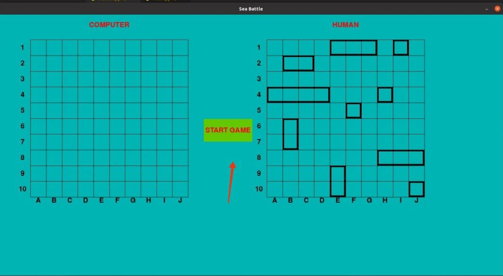

#[Mорской Бой](https://ru.wikipedia.org/wiki/%D0%9C%D0%BE%D1%80%D1%81%D0%BA%D0%BE%D0%B9_%D0%B1%D0%BE%D0%B9_(%D0%B8%D0%B3%D1%80%D0%B0))
Этот проект написано в пяти файлов:
- main.py(главный файл)
- __global_variable.py__(глобальные перемены)
- button.py(кнопки)
- draw.py(рисует корабли и другие)
- __dotted_and_hit.py__(спомогательная функция)
Используется библиотеки [pygame](https://www.pygame.org/docs/), [random](https://docs.python.org/3/library/random.html), [copy](https://docs.python.org/3/library/copy.html), [asyncio](https://docs.python.org/3/library/asyncio.html)
___
__Запуск игры__ производится компиляцией файла main.py

или с помощью клавиши __Ctrl + F5__.
___
Игра запускается нажатием кнопки __START GAME__,

Корабли автоматически размещаются системой на карте случайным образом.
___
Противником для игрока является бот. 
Размещаются 4 типа кораблей:
- 1 корабль — ряд из 4 клеток («четырёхпалубный»)
- 2 корабля — ряд из 3 клеток («трёхпалубные»)
- 3 корабля — ряд из 2 клеток («двухпалубные»)
- 4 корабля — 1 клетка («однопалубные»)
__При окончание игры обьявляется победитель.__

