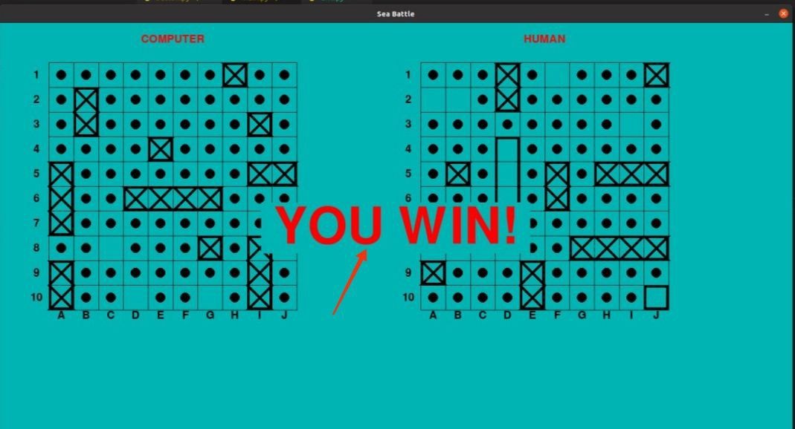

# [Mорской Бой](<https://ru.wikipedia.org/wiki/%D0%9C%D0%BE%D1%80%D1%81%D0%BA%D0%BE%D0%B9_%D0%B1%D0%BE%D0%B9_(%D0%B8%D0%B3%D1%80%D0%B0)>)

Этот проект написано в пяти файлов:

- main.py(главный файл)
- **global_variable.py**(глобальные переменные)
- button.py(кнопки)
- draw.py(рисует корабли и тд)
- **dotted_and_hit.py**(вспомогательная функция)
  Используются библиотеки [pygame](https://www.pygame.org/docs/), [random](https://docs.python.org/3/library/random.html), [copy](https://docs.python.org/3/library/copy.html), [asyncio](https://docs.python.org/3/library/asyncio.html)

---

**Запуск игры:**

Сначала склонируйте репозиторий

---

    git clone https://github.com/asliddin03/TP_Sea_Battle.git

Установите нужные библиотеки

---

    pip install -r requirments.txt

Запуск

---

    python3 main.py

---

Игра запускается нажатием кнопки **START GAME**,

Корабли автоматически размещаются системой на карте случайным образом.

---

Противником для игрока является бот.
Размещаются 4 типа кораблей:

- 1 корабль — ряд из 4 клеток («четырёхпалубный»)
- 2 корабля — ряд из 3 клеток («трёхпалубные»)
- 3 корабля — ряд из 2 клеток («двухпалубные»)
- 4 корабля — 1 клетка («однопалубные»)
  **При окончание игры обьявляется победитель.**
  

__Нужные команды для клонирования репозитория и установки необходимых фавлов__
***
    git clone -b dev https://github.com/asliddin03/Python.git
    pip install -r requirements.txt

__Установка python и допонительного пакета__
***
    sudo apt update
    sudo apt install python3.8
    sudo apt install -y python3-pip
__Переходите в папку src__
***
    cd src
__Запуск:__
***
    python3 main.py
